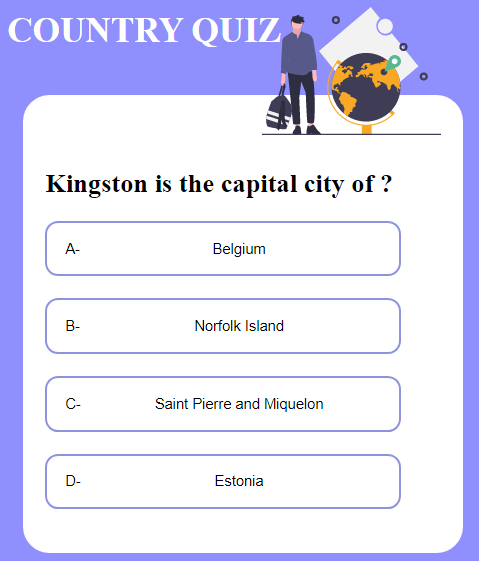

# Country Quiz

## Structure

-  You can see at least 2 types of question: a city is the capital of.. or a flag belong to country..
-  You can see select an answer in the buttons
-   You can see if your answer is correct or incorrect by getting green background or red background and also the next button appers if it is wrong or change another question if the answer is correct. 
-   When you answer correctly, you can move on to the next question
-   When you answer incorrectly, you can see your results and try again
-   You can try again

**Icon**: https://google.github.io/material-design-icons/

**API**: https://restcountries.eu/. Use data from the API to create questions and answers.

**Design** : https://www.figma.com/file/Gw0ZNBbYN8asqFlZWy3jG1

**Live app** : https://country-quiz-app.netlify.app/

As long as you fulfill all the user stories, you can give your personal touches by adding transition, using your own images, changing colors, or even creating your own layout,...

Once you completed, submit your solutions by providing URLs for both GitHub repository and live app on Netlify and explain briefly what you have done.

## Screenshot

1- The first quiz 



2- When your answer is correct


3- When your answer is wrong


4- To get another try for the quiz and see the result


## My Experience

I didn't have a lot of experience

## What I learned and improved are

There are many things that I learned from this project, such as using class react and react hooks at the same time. I tried to use router and link method but it seemed didn't work because I need a very clear path. I improved a lot on using state and fetch in class, instead of using useEffect we can use componentDidMount with async.

### Built With

<!-- This section should list any major frameworks that you built your project using. Here are a few examples.-->

-   [React](https://reactjs.org/)

## Features

<!-- List the features of your application or follow the template. Don't share the figma file here :) -->

## How To Use

<!-- Example: -->

To clone and run this application, you'll need [Git](https://git-scm.com) and [Node.js](https://nodejs.org/en/download/) (which comes with [npm](http://npmjs.com)) installed on your computer. From your command line:

```bash
# Clone this repository
$ git clone https://github.com/your-user-name/your-project-name

# Install dependencies
$ npm install

# Run the app
$ npm start
```

## Contact

-   Website [my-website.com](https://country-quiz-petah.netlify.app/)
-   GitHub [@mygithub-account](https://github.com/Tiaraha-funny)
-   Email [@my-email-adress](mailto:peta.jea@onja.org)
