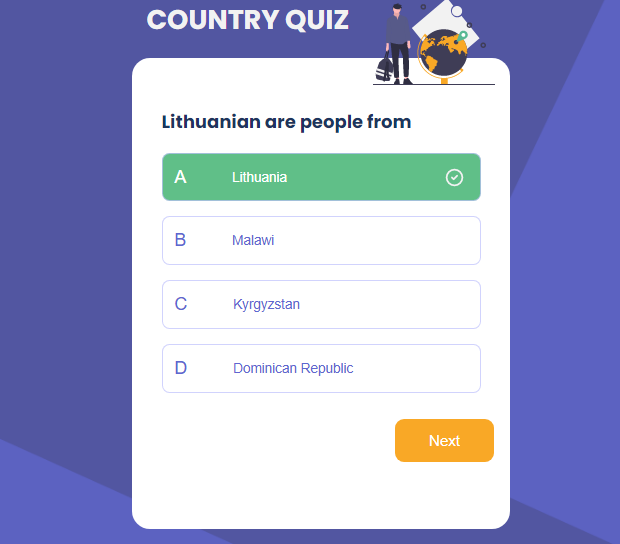

# Country Quiz


## Demo

[Country quiz app](https://country-quiz-petah.netlify.app/)

## Design

You can see the design [here](https://www.figma.com/file/Gw0ZNBbYN8asqFlZWy3jG1/Country-Quiz?node-id=1%3A130)

## **Features**

1- The first quiz


2- When your answer is correct



3- When your answer is wrong


4- See the result and get another try


## **Structure**

In this project, I create a country quiz application with pure react. This app shows us several countries whith flag and how the people of the country called.

- You can start the quiz by clicking a start button.
- You can see 3 types of question: ...is the capital of..., ...this flag belongs to... and ...are people from...
- You can see select an answer in the buttons
- You can see if your answer is correct or incorrect by getting green background or red background and also the next button appears if it is wrong or change another question if the answer is correct.
- When you answer correctly, you can move on to the next question
- When you answer incorrectly, you can see your results and can try again

## **What I Learned And Improved**

There were many things that I learned from this project, such as using useState and randoming questions. I tried to use router and link method at first but it seemed didn't work because I needed a very clear path. Also, I improved a lot on fetching an API by using useEffect and async promise.

### **This Project Is Built With**

[React](https://reactjs.org/), css and html - no framework

## **How To Use**

To clone and run this application, you'll need [Git](https://git-scm.com) and [Node.js](https://nodejs.org/en/download/) (which comes with [npm](http://npmjs.com)) installed on your computer. From your command line:

```bash
# Clone this repository
$ git clone https://github.com/Tiaraha-funny/country-quiz.git

# Install dependencies
$ npm install

# Run the app
$ npm start or open http://localhost:1234
```

## Contact

- Email [@my-email-adress](mailto:peta.jea@onja.org)
